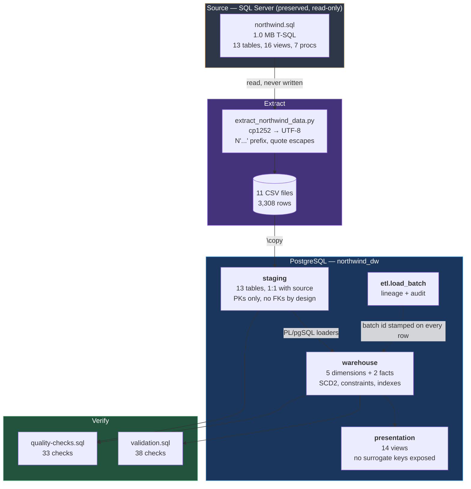
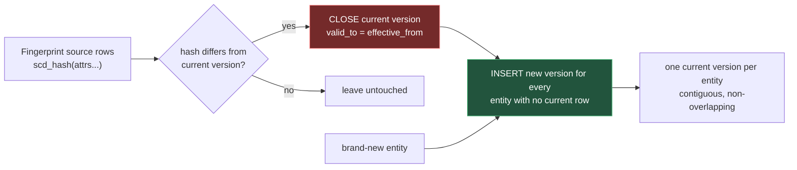
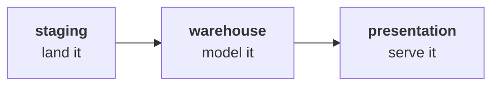

# Data Pipeline

## End-to-end flow

## Load sequence

Order is not arbitrary — each step depends on the one before.

```mermaid
sequenceDiagram
    participant C as Caller
    participant P as run_full_load()
    participant B as etl.load_batch
    participant D as Dimensions
    participant F as Facts

    C->>P: CALL run_full_load('nightly')
    P->>B: INSERT batch (RUNNING)
    P->>B: COMMIT
    Note over P,B: committed first, so the batch<br/>row survives any later failure

    rect rgb(30, 60, 90)
    Note over P,F: BEGIN ... EXCEPTION block<br/>(an implicit savepoint)
    P->>D: populate_dim_date()
    P->>D: load_dim_customer()  SCD2
    P->>D: load_dim_product()   SCD2 + Type 1
    P->>D: load_dim_employee()  SCD2
    P->>D: load_dim_shipper()   Type 1
    Note over D: dimensions first —<br/>facts resolve surrogate keys from them
    P->>F: load_fact_sales_order_line()
    P->>F: load_fact_order_fulfilment()
    end

    alt success
        P->>B: UPDATE SUCCEEDED + row counts
        P->>B: COMMIT
    else failure
        Note over P,F: handler rolls back to the savepoint
        P->>B: UPDATE FAILED + SQLSTATE + message
        P->>B: COMMIT
        Note over P,B: committed independently, or the<br/>audit row would roll back too
        P->>C: RAISE (original SQLSTATE preserved)
    end
```

## SCD Type 2 loader pattern

Every Type 2 dimension uses the same three steps.

The insert step needs **no knowledge of which rows the close step touched** — it
simply inserts for every source entity that now has no current row, which is
exactly the union of "brand new" and "just closed". That is what keeps the
loaders short and stops new and changed entities diverging.

**Order matters.** Closing before inserting is what keeps the two versions'
validity ranges adjacent rather than overlapping, satisfying the `EXCLUDE`
constraint. Reverse the statements and the load fails loudly with SQLSTATE
`23P01` — the intended behaviour.

## Layer responsibilities

| Layer | Job | Constraints | Consumers |
|---|---|---|---|
| `staging` | Land the extract unchanged | PKs only — **no FKs, no CHECKs** | ETL only |
| `warehouse` | Conformed dimensional model | Full: PK, FK, CHECK, EXCLUDE, indexes | ETL + presentation |
| `presentation` | Business-facing views | None (no storage) | Analysts, BI tools |
| `etl` | Batch control and lineage | PK, CHECK | Orchestrator |
| `reference` | Ports of the smaller training DBs | Full | Nothing downstream |

**Why staging carries no foreign keys.** A landing zone that rejects rows
destroys the evidence needed to diagnose the upstream problem. Referential
integrity is asserted by [`tests/validation.sql`](../tests/validation.sql),
which reports violations *as data* rather than aborting the load.

## Orchestration

Today the pipeline is invoked by `psql` — appropriate for 3,308 rows on a fixed
extract. There are **no SSIS packages** in the source repository to port; none
ever existed. See [`docs/migration-guide.md`](../docs/migration-guide.md) for
how this maps onto Airflow, dbt or a Python runner when scheduling, dependency
management or retries are actually needed.

## Verified performance

Measured on PostgreSQL 18.4:

| Stage | Result |
|---|---|
| Staging load (3,308 rows via `\copy`) | 11/11 tables match canonical counts |
| Full warehouse load (6,452 rows) | 0.70 s |
| Re-run with no source change | 0 inserted, 0 updated — a genuine no-op |
| Revenue reconciliation | £1,265,793.04 identical across all three layers |
