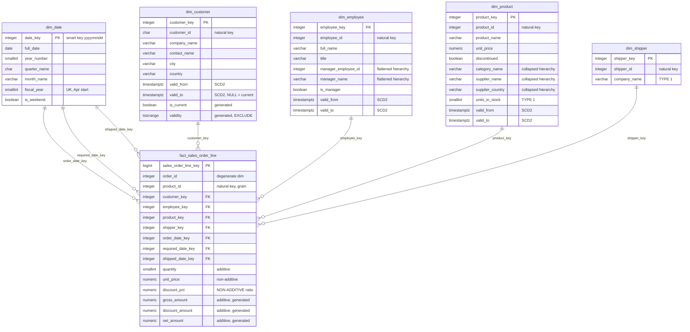
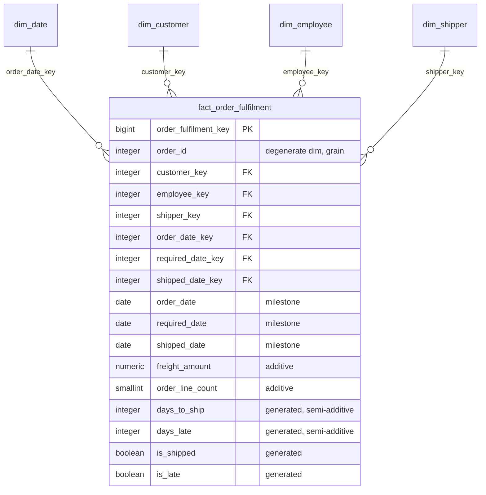
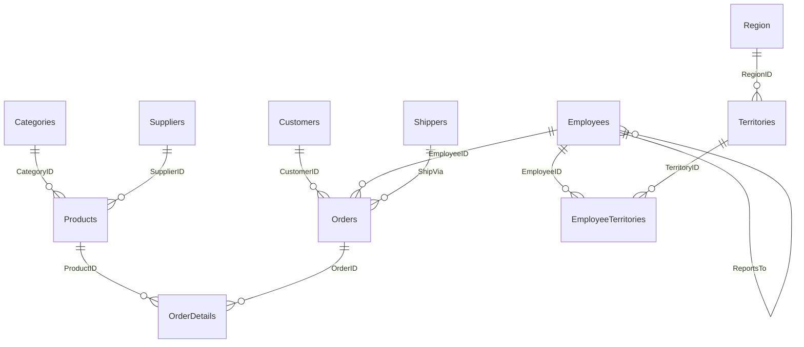

# Star Schema — Dimensional Model

Rendered by GitHub natively. Source of truth for these objects is
[`postgres/database/20_dimensions.sql`](../postgres/database/20_dimensions.sql)
and [`postgres/database/30_facts.sql`](../postgres/database/30_facts.sql).

## Sales star — transaction grain

**Grain: one row per product per order.** Owns every revenue measure.

## Fulfilment star — accumulating snapshot

**Grain: one row per order.** Owns freight and delivery-cycle measures, and
deliberately **no revenue measures** — so no query can double-count by joining
both facts.

### Why two facts

The source `Orders` table mixes two grains: order lines, and the order itself
(freight, ship-to address, milestone dates). Modelling both in one fact is the
most common dimensional modelling error there is.

**Measured on this data:** true freight is **£64,942.69**. Summed across the
line grain it becomes **£207,306.10** — an overstatement of **3.19×**. Note that
is *higher* than the 2.60 average lines per order, because larger orders carry
more freight and are weighted more heavily by the duplication.

The two facts join on the degenerate dimension `order_id` when a question needs
both — the correct way to combine facts of differing grain.

## Bus matrix

| Business process | Grain | Date | Customer | Employee | Product | Shipper |
|---|---|:--:|:--:|:--:|:--:|:--:|
| Sales order line | product per order | ● | ● | ● | ● | ● |
| Order fulfilment | order | ● | ● | ● | — | ● |

Both facts share the same conformed dimensions, so they can be compared and
drilled across without translation.

## Source system — Northwind OLTP (3NF)

What the warehouse is built *from*. Preserved unmodified in
[`sqlserver/database/northwind/`](../sqlserver/database/northwind/).

| Table | Rows |
|---|---:|
| Categories | 8 |
| Customers | 91 |
| Employees | 9 |
| Order Details | 2,155 |
| Orders | 830 |
| Products | 77 |
| Region | 4 |
| Shippers | 3 |
| Suppliers | 29 |
| Territories | 53 |
| EmployeeTerritories | 49 |

## Key design

| Concern | Decision |
|---|---|
| Dimension keys | Meaningless surrogates, `GENERATED ALWAYS AS IDENTITY` — nothing outside ETL may supply one |
| Date key | Smart key `yyyymmdd` — readable in raw fact data, sorts correctly, range-scannable without a join |
| Natural keys | Retained as dimension attributes for audit and lookup |
| Unresolved lookups | Every dimension has an Unknown member at `-1`; fact FKs are `NOT NULL DEFAULT -1` |
| Degenerate dimensions | `order_id`, `product_id` — identifiers with no attributes of their own live on the fact |
| Hierarchies | Collapsed into the dimension, never snowflaked |

Because unresolved lookups land on `-1` rather than `NULL`, every fact-to-dimension
join is a plain inner join that cannot drop a row — which is what allows the
tests to treat *any* orphan as a hard failure rather than an expected condition.
